# sample-camera-edge-data-intelligence-transformation-with-bedrock

## Overview
このサンプルは、監視カメラの映像をリアルタイムにAWSに取り込み、生成AIによって映像解析するプラットフォームの実装サンプルです。
建設現場、工場、物流センター、店舗などで利用されるカメラ映像をクラウド上で統合管理し、生成AI（Amazon Bedrock）とコンピュータビジョン（YOLOv9）で自動解析するシステムを、すぐにデプロイして試せる形で提供しています。

本サンプルは以下の展示会にて、建設不動産チームとしてブース展示させて頂いたものの公開版となります。
- AWS Summit Japan 2025
- JAPAN BUILD TOKYO 建設DX展 2025
- 建設RXコンソーシアム Exhibition2025

関連ブログ：

[https://aws.amazon.com/jp/blogs/news/japan-build-tokyo-cre-booth-and-sessions/](https://aws.amazon.com/jp/blogs/news/japan-build-tokyo-cre-booth-and-sessions/)

[https://aws.amazon.com/jp/blogs/news/aws-summit-2025-japan-cre-booth-and-sessions/](https://aws.amazon.com/jp/blogs/news/aws-summit-2025-japan-cre-booth-and-sessions/)

## Use Case
本サンプルを拡張させることで、以下のようなユースケースに対応可能です。
- **建設現場の安全監視**: ヘルメット未着用、立入禁止区域侵入の自動検知
- **工場の品質管理**: 製造ラインの異常検知、作業手順の確認
- **物流センターの監視**: 荷物の移動追跡、作業効率の分析
- **店舗のセキュリティ**: 不審者検知、混雑状況の把握

## Architecture
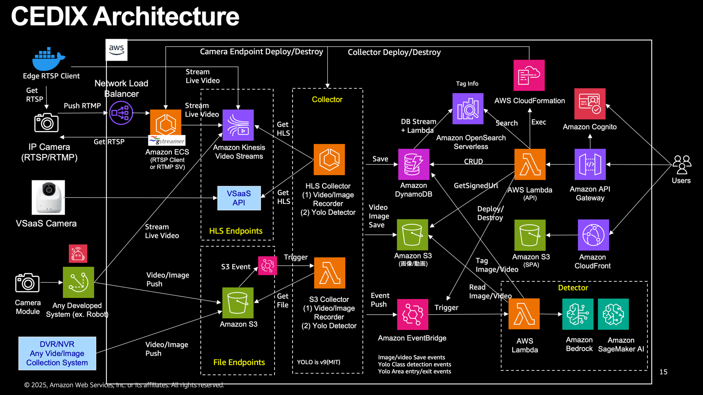

## Key Feature
| 課題 | 解決策 |
| --- | --- |
| **マルチソース映像統合** | RTSPカメラ、RTMPカメラ、VSaaSクラウドカメラ、KVS、S3など異なる経路の映像収集に対応。映像ソースを一元的に集約するETLを提供する。<br> |
| **AIMLによる映像解析** | 集約した映像解析には、YOLOv9(MITライセンス版) によるリアルタイム解析、Amazon Bedrockによる画像/映像解析を利用可能。解析結果として画像/動画に任意のタグ付けがされる。<br>別途独自のモデルも組み込み可能。 |
| **24時間365日の自動映像確認** | 人間が24時間分の映像を全て見る必要なし。AIが検出した重要イベントは通知可能。また通知結果を１クリックで確認可能 |
| **映像のスケーラブルアーキテクチャ** | 接続するカメラ台数が増えたとしても、ECS & サーバーレスアーキテクチャーにより対応可能。 |

## Feature details


### Camera Management
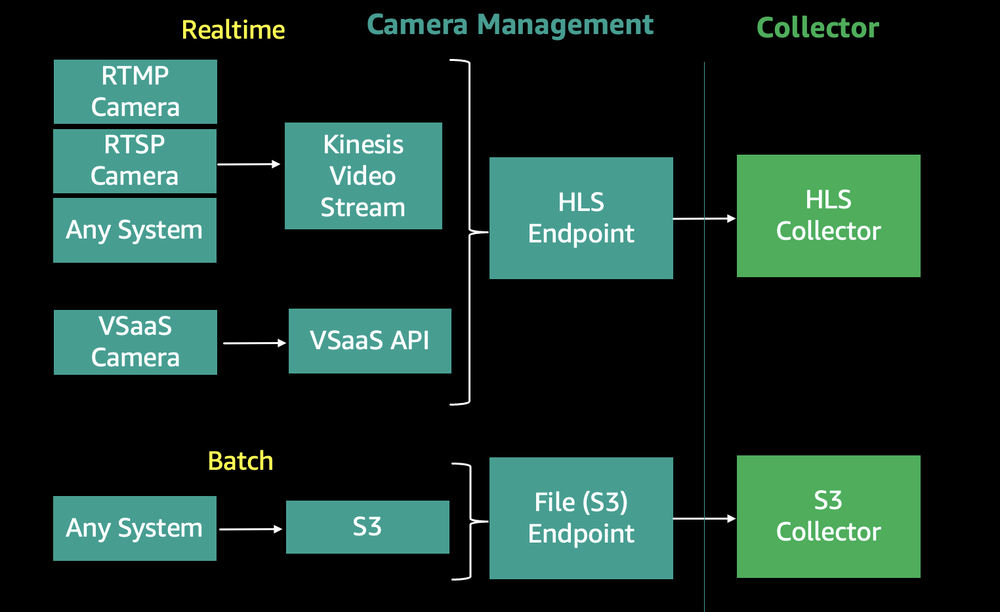
本サンプルはリアルタイムの映像収集と、バッチでの映像収集に対応しています。
リアルタイム収集では、監視カメラ（RTSP/RTMP）やVSaaSカメラなどのストリーミング映像を取得し、HLSエンドポイントを提供します。基本的に映像はKinesis Video Streams（KVS）に変換され、そのHLSエンドポイントが後続処理で利用されます。VSaaSのようにデフォルトでHLSエンドポイントを生成する機能がある場合は、そのエンドポイントを直接利用します。
また、バッチについては、動画や画像を直接アップロードする形での映像収集の機能となります。CEDIXはカメラからの映像アップロード用のS3バケットを提供しており、そこにアップロードされたファイルはコレクターを経由して時系列で管理されます。

[管理しているカメラ一覧画面]
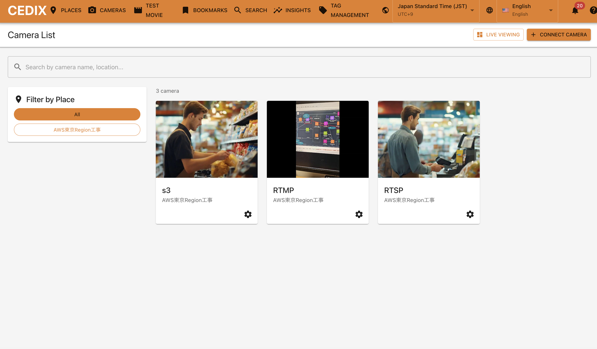
[カメラ編集画面]

#### リアルタイム収集
- RTSPカメラ
  - CEDIXでは、RTSP/RTSPSサーバー搭載のカメラに接続して映像を取得することが出来ます。
  - CEDIXでは、RTSPカメラへの接続パターンを２つ用意しています。
  - 1つ目は、AWS側からRTSPカメラに直接接続するパターンです。この場合、RTSPカメラを配置しているネットワークでポート開放が必要です。なお、このテストのために「テスト動画」機能を用意しています。
  - 2つ目は、RTSPカメラと同一ネットワークにRTSP収集クライアントを配置するパターンです。CEDIXはRTSP収集クライアントをDockerfileで提供しており、任意の端末でセットアップして動作させることで映像収集が可能です。
- RTMPカメラ
  - CEDIXでは、RTMPエンドポイントを公開し、RTMPクライアント機能搭載のカメラからの映像を受信することが出来ます。テスト目的であれば、スマートフォンのRTMPクライアントアプリなどから配信してのテストも可能です。
  - なお、RTMPのみ対応（RTMPS非対応）。
  - RTMPSに対応したい場合は、Network Load Balancer (NLB) でTLS終端 ( AWS Certificate Manager で発行した公開証明書利用が推奨) し、配下のRTMPサーバには平文のRTMPを投げる構成が最もシンプルです。
  - なお、NLB → ECS 間もTLSを維持したい場合は、ECS側に証明書配置する必要が出ます。
- クラウドカメラ（VSaaS対応）
  - VSaaS については、特定のVSaaSに対応していますが、現状は無効化しています。AWS利用の法人様の場合、担当のSolution Architect にご相談ください。
- それ以外の映像ソースについて
  - Kinesis Video Streams をエンドポイントとして立ち上げることも可能です。
  - そのため、カメラ搭載システムなどで、KVSに映像を送信できれば、CEDIXに映像を連携可能です

#### バッチ収集
- S3
  - CEDIX では S3 タイプのカメラを作成すると、S3の収集エンドポイント(S3 バケットのパス)を生成します
  - そのS3パスに画像/動画を送信すれば、バックエンドのS3コレクターが時系列で保存・管理します。また、そのタイミングにて YOLOv9(MITライセンス版)での解析や、Amazon Bedrockによる解析も実施可能です。

#### 接続パターン:
| タイプ | ソース | 映像の収集方法 | 変換後の映像エンドポイント | Quick Start |
| --- | --- | --- | --- | --- |
| RTSP | RTSPカメラ | 現場設置のRTSPクライアント(Docker)が同一ネットワーク上のRTSPカメラに接続してRTSP映像を取得してKVSに送信 | KVS (HLS) | [RTSP(ローカル)](doc/QUICK_START_RTSP_LOCAL.md) |
| RTSP | RTSPカメラ | AWS側から現場RTSPカメラに直接接続してRTSP映像を取得してKVSに送信 | KVS (HLS) | [RTSP](doc/QUICK_START_RTSP.md) |
| RTMP | RTMPカメラ | AWS側で公開される RTMPエンドポイントに、現場RTMPカメラから接続して映像送信。それがKVSに変換される。 | KVS (HLS) | [RTMP](doc/QUICK_START_RTMP.md) |
| VSaaS | クラウドカメラ | VSaaS が提供しているAPI(HLSエンドポイントを取得する) をそのまま無変換で利用 | VSaaS(HLS) | - |
| KVS直接 | 組込カメラ(例) | 送信元の実装により、直接KVSに映像を送信する | KVS (HLS) | - |
| S3 | 組込カメラ(例) | 送信元の実装により、直接S3に映像(動画/画像)を送信する | S3 Bucket (File) | [S3](doc/QUICK_START_S3.md) |

#### RTMPカメラの要件
- コーデックは H.264のみ。解像度上限、フレームレート、ビットレート上限は Kinesis Video Streamsに依存。論理値としては、解像度4K、最大フレームレート60fps、最大ビットレート100Mbpsとなります (2026-2-10時点)が、現実的には映像を処理するCamera Mangement の ECSサービスのスペックに依存します。音声は現状破棄されます。
- Collectorでレコーダー機能を使う場合、レコーダーを動作させるECSサービスのメモリの問題により、現状は解像度は720p程度までしか対応出来ません。より高解像度の映像の画像/動画切り出しをする場合はメモリを増加してください。
- 配信開始してから接続までに初回は1-3分かかることがあります。

#### RTSPカメラの要件
- コーデックは H.264のみ。解像度上限、フレームレート、ビットレート上限は Kinesis Video Streamsに依存。論理値としては、解像度4K、最大フレームレート60fps、最大ビットレート100Mbpsとなります (2026-2-10時点)が、現実的には映像を処理するCamera Mangement の ECSサービスのスペックに依存します。音声は現状破棄されます。
- Collectorでレコーダー機能を使う場合、レコーダーを動作させるECSサービスのメモリの問題により、現状は解像度は720p程度までしか対応出来ません。より高解像度の映像の画像/動画切り出しをする場合はメモリを増加してください。

#### RTSPカメラへの接続について
**AWSから直接接続できるポートをルーターに開けれる場合:**
- AWS側からRTSPカメラに直接接続をする場合、一般的にはRTSPカメラが設置されているネットワークのルーターでポート開放&ポートフォワーディングが必要です。
- その機能をテストする場合、「テスト動画」機能を利用ください。テスト動画では、指定した動画を再生するRTSPサーバーをECSサービス内に構築し、それをソースとしてRTSPカメラのテストを可能にします。

**AWSから直接接続できるポートをルーターに開けれない場合：**
- `backend/camera_management/docker/rtsp_reciver` のプログラム一式を任意のPCにインストールして、RTSPカメラのネットワーク内でDockerを稼働させてください。
- ローカルネットワーク内のRTSPカメラから映像を引き出し、Kinesis Video Streams に映像を送信してくれますので、ルーターのポート開放が不要になります。
- なお、PC は Linux推奨で、aws-cli と Docker が必須です。AWSに接続できる認証情報も必須です。一般的に長期クレデンシャルは非推奨なので、IAM Roel Anywhere を利用するか、AWS IoT の認証機構をご検討ください。

#### ライブビューについて
- HLS系の映像ソースについては、カメラ画面にてライブ映像を確認できます。

### Collector
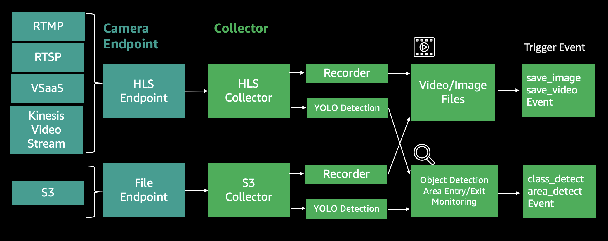
コレクターは、映像ソースと直接接続してリアルタイム/ニアリアルタイム での処理を行うモジュールです。
もっとも基本となるのはレコーダー機能で、映像ソースから画像と動画を切り出す機能となります。
また、収集している映像ソースに対してリアルタイムにYOLOv9(MITライセンス版)モデルで画像解析する機能もあります。具体的には、リアルタイムでの物体検出と、指定エリアへの侵入・退出判定を行う機能を用意しています。
なお、各コレクター機能は自身に与えられた処理を行った際に、EventBridgeに対してEventを発行します。後続のDetectorはそれらのイベント駆動にて処理を行うことを想定しています。

#### レコーダー機能
- 映像ソースから動画と画像を切り出して保存する機能です。
- HLS系の映像ソースの場合は、ECSサービスを起動し、HLSをリアルタイムに受信しながら、動画と画像を切り出して保存し、時系列情報を付与します。
- S3系の映像ソースの場合は、S3 保存のタイミングで Lambdaを起動し、保存された動画と画像を管理領域にコピーし、時系列情報を付与します。
- なお、画像や動画の保存の際に、`save_image`  や `save_video`  イベントを、EventBridge に対して発行します。後続のDetectorはそれらのイベント駆動にて処理を開始できます。

[レコーダーが記録した画像を確認できる画面]
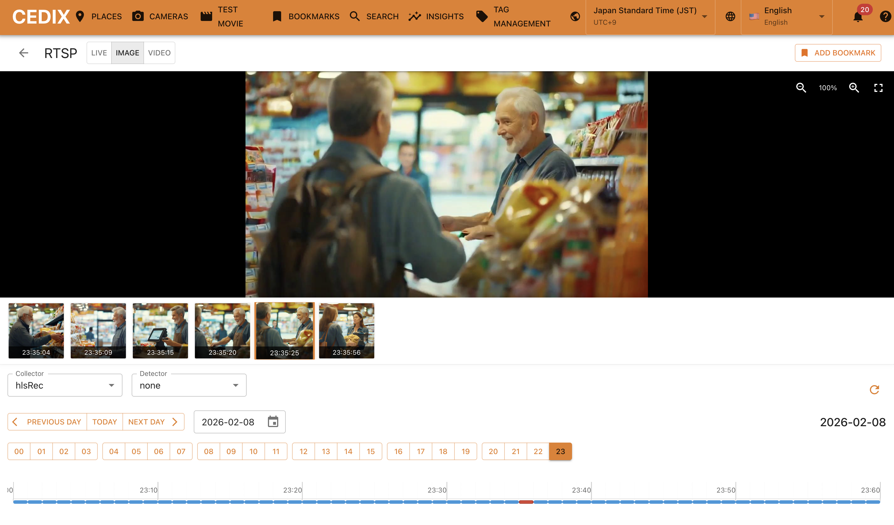
#### リアルタイムYolo検出機能
- YOLOv9 MIT & ByteTrackアルゴリズムによる物体追跡
  - `class_detect`: 特定クラスのオブジェクト検出
  - `area_detect`: 指定ポリゴン領域への侵入/退出検知
- HLS系の映像ソースの場合は、 ECSサービスを起動し、HLSを受信しリアルタイムにクラス検出&侵入/退出検知を実施します
- S3系の映像ソースの場合は、画像/動画保存のEventをトリガーとして、クラス検出を実施します。S3系については、侵入/退出検知はありません。
- 用途については、そのままご利用頂いても良いですし、ご自身のモデルをCEDIXに組み込む際の参考として使って頂くのも良いです。また、Amazon Bedrockによる検出回数を減らしてコスト最適化するためのフィルター機能としての利用も推奨しています。画像・動画が作成されるたびに生成AIで解析するとコストがかかるため、YOLOで事前フィルタリングすることで効率化できます。
- なお、`class_detect` も`area_detect`  発生時に、EventBridge に対してイベントを発行します。後続のDetectorはそれらのイベント駆動にて処理を開始します。
- なお、YOLOv9(MITライセンス版)のコレクターを作成すると、自動で `collector-internal` という Detectorが作成されます。これはYOLOの検出結果を保存するDetectorとなりますので、削除しないようお願いします。

[YOLOが検出した画像や検出結果を確認できる画面]
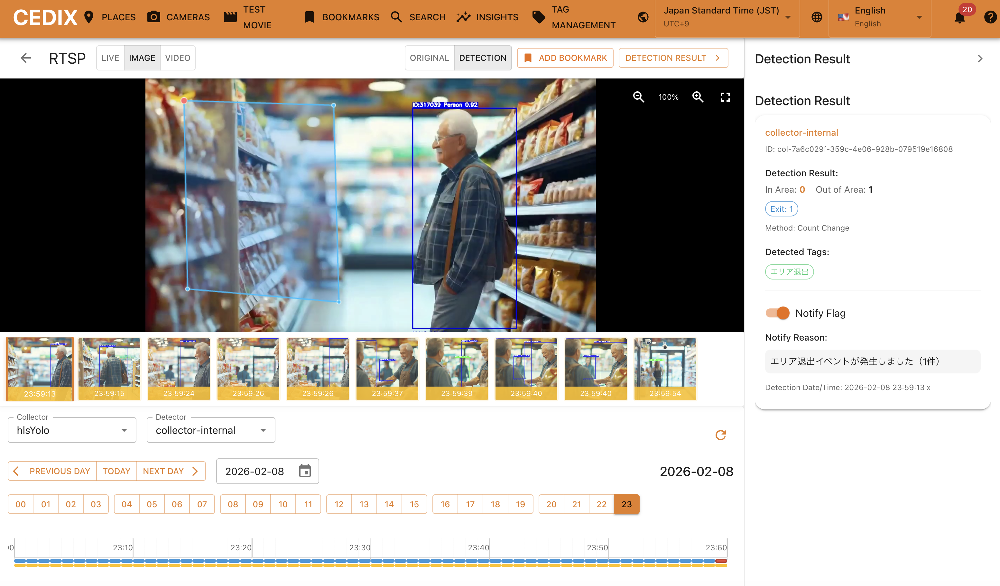

| タイプ | 機能 | Collector名 | 実行環境 | 説明 | 発生するイベント |
| --- | --- | --- | --- | --- | --- |
| HLS | レコーダー機能 | **hlsrec** | ECS | HLSストリームから画像/動画キャプチャ | `save_image`  `save_video` |
| HLS | リアルタイムYolo検出機能<br> | **hlsyolo** | ECS | YOLOv9(MITライセンス版)リアルタイム物体検出 + 指定ポリゴン領域への侵入/退出検知 | `class_detect` `area_detect`<br> |
| S3 | レコーダー機能	<br> | **s3rec** | EventBridge + Lambda | S3からメディア収集 | `save_image`  `save_video` |
| S3 | リアルタイムYolo検出機能<br> | **s3yolo** | EventBridge + Lambda | YOLOv9(MITライセンス版)物体検出 | `class_detect` <br> |


### Detector
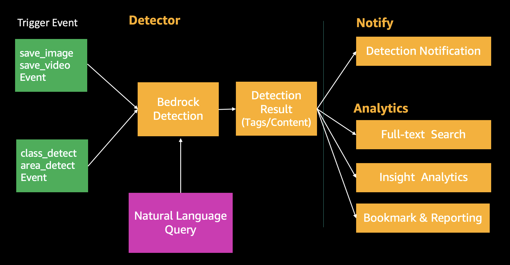
Amazon Bedrockの生成AIモデルを利用して、映像解析およびタグ付けを行います。映像から検出したいタグについて自然言語で指定可能です。カメラごとに自然言語で解析内容を指定できるため、AIの専門知識がなくてもカメラの設定が可能です。

#### タグ作成&管理機能
- Bedrock に検出させたいタグは、事前にタグ管理機能にて登録しておく必要があります。タグ管理画面を開き、タググループ、タグの順番で登録が必要です。
- カメラごとに１からタグを登録することも可能ですが、多くの場合、同じタグを複数のカメラに設定する必要があります。そのため、基本的にタグ管理を上手く利用することが推奨です。
- なお、Detectorの登録画面ではタググループの一括ロードまたは、個別タグの個別ロードが可能になっていますので、柔軟に設定できます。

[タグ管理画面]
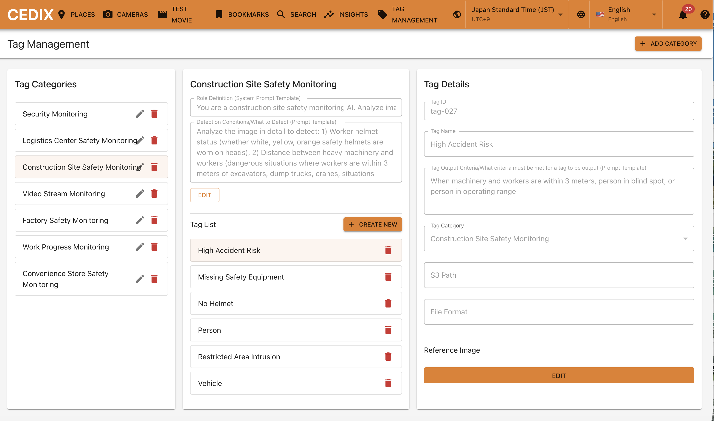
#### Detector機能
- `save_image` `save_video` `class_detect` `area_detect` イベントの何れかをトリガーとして画像または動画を Amazon Bedrock が提供している基盤モデルを利用して解析します。
- 設定としては、「基盤モデル」指定した上で、以降は自然言語にて「役割」の指定、「検出したいもの」の指定、「検出したものがどういう状態であれば、どういうタグを出力するか」のタグ設定 を行います。タグ設定は前述のタグ管理機能から簡単に読み込んで設定できます。
- 基盤モデルは Amazon Bedrock が利用できるモデルであればどのモデルでもご利用頂けますが、前提として画像を解析させる場合にはimg2txtに対応しているモデル、動画を解析させる場合にはvideo2txtに対応しているモデルのみ動作します。
- 画像解析に適したモデルの例 (2026-2-7時点)
  - Claude Haiku 4.5、Claude Sonnet 4.5、Amazon Nova2 Lite や、Amazon Nova2 Pro など
- 動画解析に適したモデルの例
  - Amazon Nova2 Lite や、Amazon Nova2 Pro など
  - 動画については Amazon Nova系モデルを推奨します。Nova系については Amazon S3 URI経由での動画ファイル受け渡しが可能であり、1GBのファイル解析 が可能な一方で、それ以外のモデルは 25MBなどが上限となっているのが理由です (2026-2-7時点の情報のため、変更されている可能性があります。必ずAWS Documentにてご確認ください)
  - 詳細
    - https://docs.aws.amazon.com/nova/latest/nova2-userguide/using-multimodal-models.html#video-understanding
- 設定時の注意
  - ファイルタイプとトリガーイベントを間違えて設定すると何も検出しません。

[Detectorの検出結果を確認できる画面]
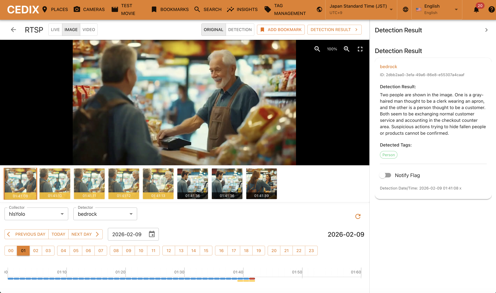
[Detector設定画面]
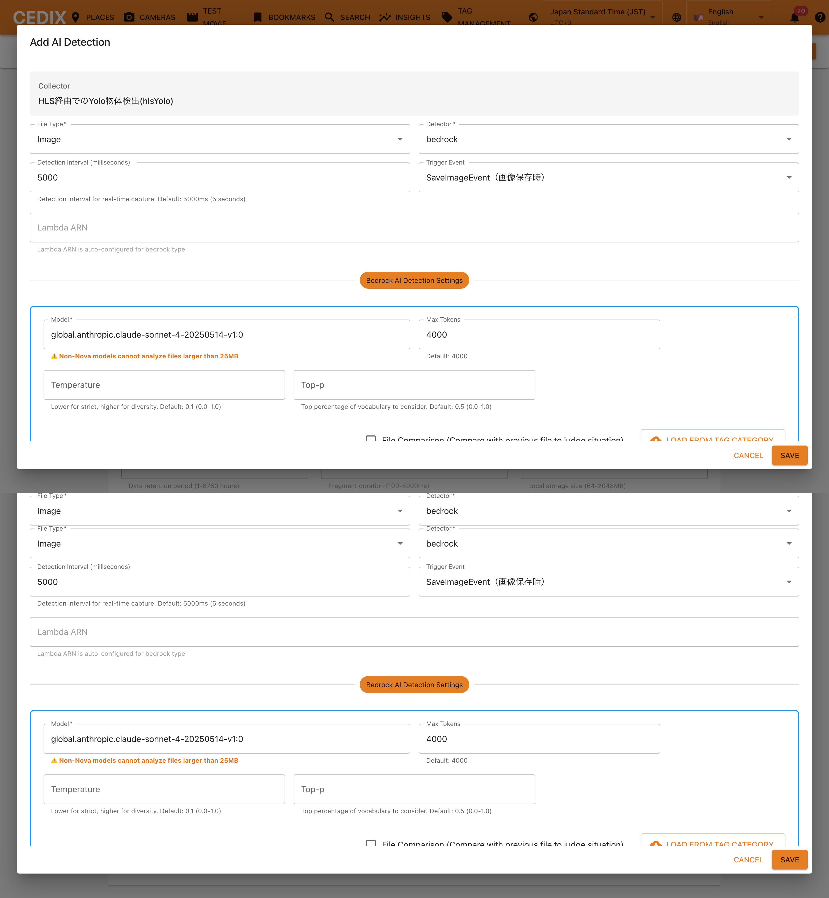

### Notify
- Detectorでタグを登録する際に「通知」をONにすると、そのタグが検出された時点で通知されます。現状は、あくまでCEDIXのUI内だけでの通知表示となります。
- もし、メール、Slack、Teamsなどへの通知が必要な場合、現状、cedix-detect-log テーブルの変更をDynamoDB Streamで取得してLambdaで処理をしている箇所 (backend/analytics/docker/ingestion) があるため、そこに分岐処理を入れて detect_notify_flg が true の場合に Amazon SNS にレコード内容をPushする処理を入れることを推奨します。
- Amazon SNS からメールに流せますし、Amazon Q Developer in chat applications を経由することで Teams/Slack に通知メッセージを流すことも可能です。

[Notify History画面]
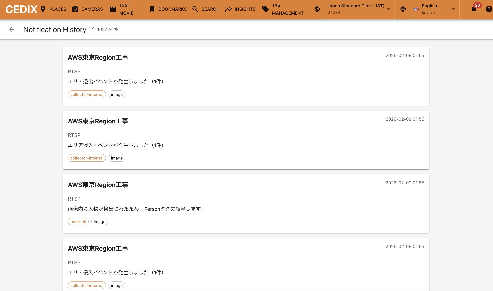

### Analytics
検出結果はcedix-detect-logテーブルに格納されると同時に、DynamoDB Streams + Lambdaを経由してAmazon OpenSearch Serviceに連携されます。分析は一部を除き、OpenSearchに格納されたデータを利用して実施されます。
なお、OpenSearch はフルテキスト検索できるようにセットアップされていますが、格納時のロジックを修正することでベクトル化も可能です。Amazon OpenSearch Service はフルテキスト検索とベクトル検索を同時に実行可能です。

#### 検出結果の検索機能 (Full-text Search)
- Amazon OpenSearch Service による検出結果の高速検索が可能です。
- 気になるキーワードでのフルテキスト検索だけでなく、場所、カメラ、タグなどでの検出結果絞り込みが可能です。
- ヒットした検出結果から、実際の画像/映像にジャンプして確認することも可能です。

[検索画面]
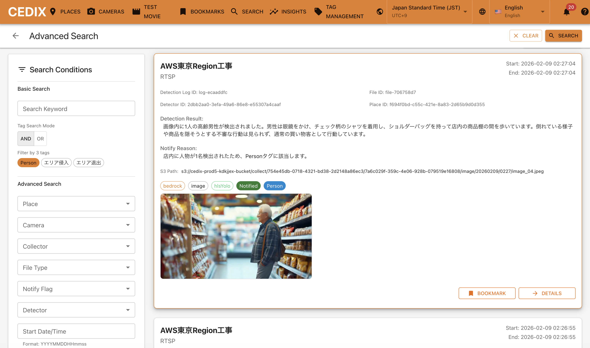

#### 時系列でのインサイト分析機能 (Insight Analytics)
- 場所、カメラで絞り込んだ上で、各タグの発生頻度を時系列にマッピングして可視化します
- これにより、どの時間でどのタグがどれくらい発生したのか？を確認することが可能です。
- ヒットした検出結果から、実際の画像/映像にジャンプして確認することも可能です。

[インサイト分析画面]
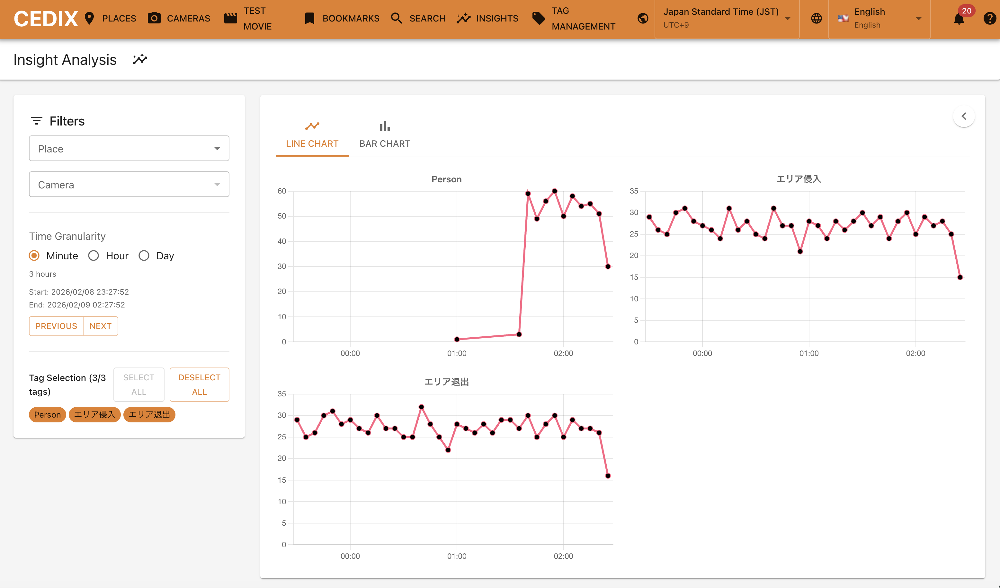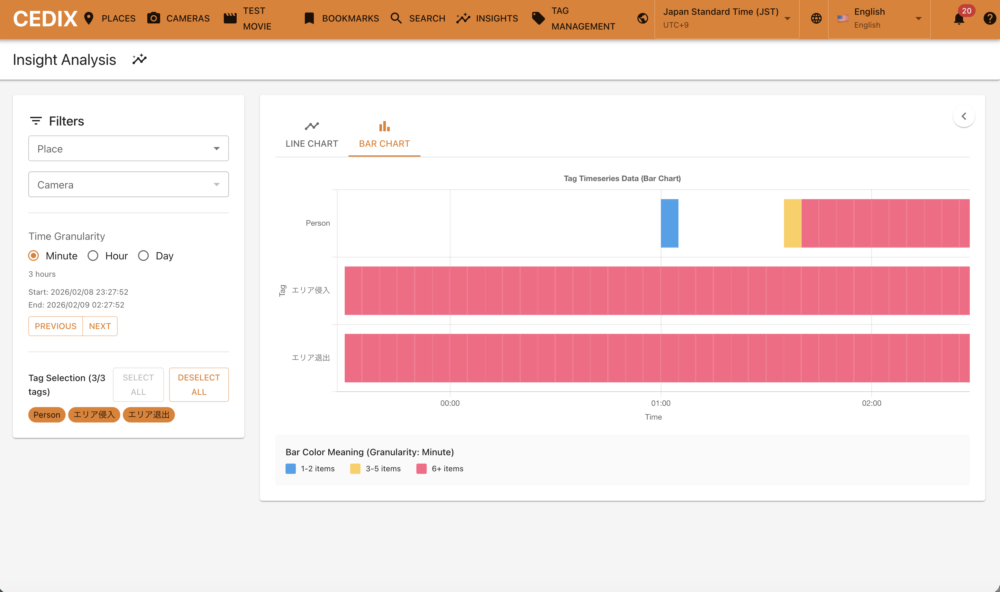

#### ブックマークをした上でのレポート機能 (Bookmark & Reporting)
- CEDIXでは、Collectorが切り出した画像や映像を画面上からブックマークすることが出来ます。
- 結果はブックマーク画面より確認ができ、一覧で確認することが可能です。
- さらに、レポート作成ボタンを押すと、選択した画像/動画の `detect-log` を読み込んで、指定プロンプトにしたがってレポートを作成する機能を利用できます
- ただし、この機能は簡易的なサンプル実装です。本来は指定した画像/動画をバイナリとして読み込んで指定に基づいて解析した方がより正確ですが、現在はDetectorの検出結果をベースに解析する簡便な分析を実施します。

[ブックマーク画面]
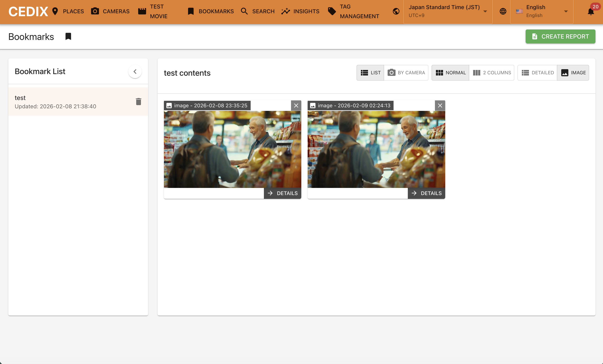

## Repo Structure
```
CEDIX/
├── backend/                      # バックエンドサービス群
│   ├── api_gateway/             # 統合APIゲートウェイ（FastAPI + Mangum）
│   ├── camera_management/       # カメラ管理サービス
│   │   ├── deployment/         # RTMP/RTSP/VSaaSデプロイ設定
│   │   └── docker/             # RTMP/RTSP/VSaaS受信コンテナ
│   ├── collector/               # データ収集サービス
│   │   ├── deployment/         # hlsrec/hlsyolo/s3rec/s3yolo
│   │   └── docker/             # 各種収集コンテナ
│   ├── detector/                # AI検出サービス（Bedrock解析）
│   ├── analytics/               # 分析・検索サービス（OpenSearch連携）
│   ├── place/                   # 現場管理サービス
│   ├── test_movie/              # テスト動画配信サービス
│   └── shared/                  # 共通モジュール（認証、DB、タイムゾーン等）
│
├── frontend/                    # フロントエンド
│   └── web_app/                # React SPA (Vite)
│       └── src/
│           ├── components/     # 再利用可能コンポーネント
│           ├── pages/          # ページコンポーネント
│           ├── services/       # API通信ロジック
│           ├── utils/          # ユーティリティ関数
│           └── i18n/           # 国際化設定（日本語・英語）
│
├── infrastructure/              # インフラストラクチャ
│   ├── cdk/                    # AWS CDK定義
│   ├── edge/                   # エッジデバイス関連
│   ├── migrations/             # DBマイグレーション
│   └── testdata/               # テストデータ
│
├── _doc/                        # ドキュメント
├── CODE_OF_CONDUCT.md
├── CONTRIBUTING.md
├── LICENSE
└── README.md
```

## Quick Setup
### 前提条件
**ビルド環境(動作確認済)**:
- OS
  - macOS Monterey 以降
  - Ubuntu 24.04 LTS (on EC2)
    - [Ubuntuセットアップ資料](doc/README_Ubuntu_INSTALL.md)
- メモリ
  - 16GB以上推奨

**必要なソフトウェア**:
- AWS CLI（認証情報設定済み）
- Node.js v20以上
- AWS CDK（`npm install -g aws-cdk`）
- Docker

### デプロイ手順
#### 前提
本リポジトリをCloneし、ルートディレクトリに移動していることを前提とします。

#### ステップ1: YOLOv9設定ファイルのセットアップ
YOLOv9 MITの設定ファイルをダウンロードします。
```bash
cd backend/shared/yolo_detector
./setup_yolo.sh
cd ../../../
```

#### ステップ2: CDK設定ファイルのセットアップ
```bash
cd infrastructure/cdk
cp cdk.config.json.template cdk.config.json

```

`cdk.config.json` を編集:
```json
{
  "stackPrefix": "cedix-prod",
  "region": "ap-northeast-1",
  "s3AdditionalPrefix": "<unique-prefix>"
}
```

| キー | 必須 | 説明 | 例 |
| --- | --- | --- | --- |
| `stackPrefix` | ✅ | CloudFormationスタック名のプレフィックス。全AWSリソース名に使用されます。環境ごとに異なる値を設定してください。 | `cedix-dev`, `cedix-prod` |
| `region` | ✅ | デプロイ先のAWSリージョン。Bedrockが利用可能なリージョンを指定してください。 | `ap-northeast-1`, `us-east-1` |
| `s3AdditionalPrefix` | ✅ | S3バケット名のグローバル一意性を確保するためのプレフィックス。組織名や日付など、他と重複しない値を設定してください。半角英数。 | `mycompany-2025`, `project-abc` |

#### ステップ3: CDK Bootstrap
```bash
cdk bootstrap

## ↑で ts-node not foundなどでる場合は、↓を実行してから再度お願いします
npm install
```

#### ステップ4: CloudFront署名キーの作成
```bash
sudo rm -rf keys/
./setup-cloudfront-keys.sh
```

#### ステップ5: リソースのデプロイ
メインリソースの一括デプロイ:
```
# 基本
./run-cdk.sh deploy --all

# 一切の確認不要で実行したい場合
./run-cdk.sh deploy --all --require-approval never
```
- 一括デプロイで失敗する場合、個別デプロイを推奨します。詳細は [CDK_ARCHITECTURE](_doc/CDK_ARCHITECTURE.md) を参照ください。

Webアプリケーションのデプロイ:
```bash
# 基本
./run-cdk-webapp.sh deploy --all

# 一切の確認不要で実行したい場合
./run-cdk-webapp.sh deploy --all --require-approval never
```
- 上記の実行結果として、CEDIXの CloudFront URL が発行されます。

#### ステップ6: テストデータの投入 (option)
タグ管理用のテストデータを作成します。これは必須ではありません。
```bash
cd infrastructure/testdata
./start.sh --lang ja

# Ubuntu/EC2環境の場合（IAMロール使用）
./start.sh --ubuntu --lang ja
```

#### ステップ7: ログイン設定
CEDIXはCognitoにて認証をするため、ユーザー作成が必要です。
1. AWS Console にログイン → Cognito で検索 → ユーザープールを選択 (`<stackPrefix>-user-pool`)
2. サイドバーの ユーザー管理 > ユーザーを選択
3. ユーザーを作成をクリックして、ユーザーを作成
4. CloudFront URL にアクセス
5. 作成したユーザーでログイン

## Cleanup
以下のコマンドでデプロイしたリソースのクリーンナップが可能です。
```bash
cd infrastructure/cdk
./cleanup_resources.sh
```
**注意**: このスクリプトは全リソースを削除します。本番環境では慎重に使用してください。

## Getting Started
以下のドキュメントをご確認ください

- [Quick Start RTSPカメラ](doc/QUICK_START_RTSP.md)
- [Quick Start RTSPカメラ（ローカルネットワーク経由）](doc/QUICK_START_RTSP_LOCAL.md)
- [Quick Start RTMPカメラ](doc/QUICK_START_RTMP.md)
- [Quick Start S3カメラ](doc/QUICK_START_S3.md)

## 関連ドキュメント
### 技術ドキュメント
| ドキュメント | 説明 |
| --- | --- |
| [APIエンドポイント一覧](doc/API_ENDPOINTS.md) | 全エンドポイントの一覧 |
| [CDK構成ガイド](doc/CDK_ARCHITECTURE.md) | 16スタックの詳細と依存関係 |
| [開発者向けガイド](doc/README_DEV.md) | 開発環境のセットアップと開発フロー |
| [データベース設計書](doc/database-design.md)<br> | データベース設計書 |

## CONTRIBUTING
本プロジェクトへの質問や改善提案の詳細は、[CONTRIBUTING](CONTRIBUTING.md) をご確認ください

## LICENSE
[LICENSE](LICENSE) をご確認ください
