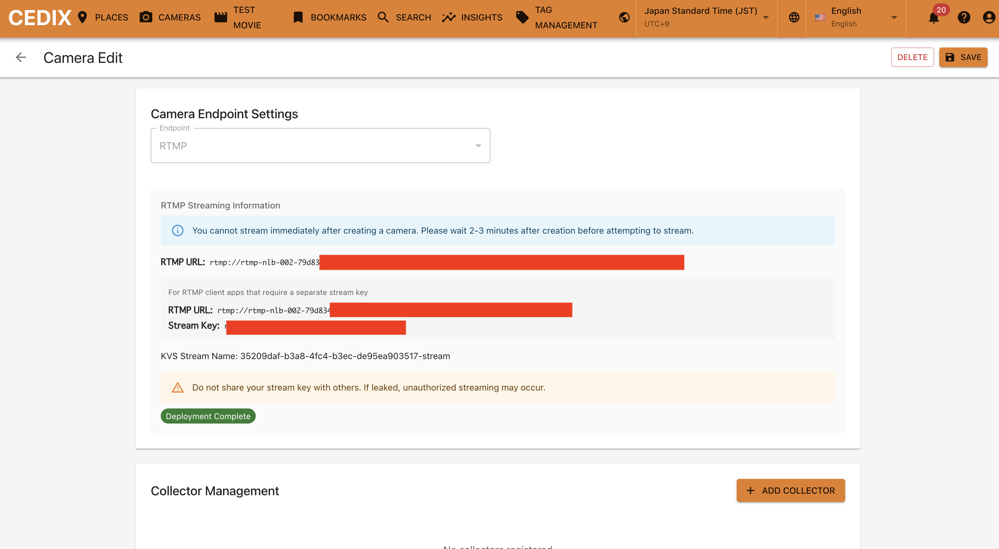

# Quick Start RTMP Camera
本ドキュメントではRTMP のカメラからのセットアップに限定して記載します。カメラ以外の操作は全て RTSP Cameraと一緒ですので、そちらをご確認お願い致します。

[QuickSetup RTSPカメラ](doc/QUICK_START_RTSP.md)

### Camera と接続する
カメラ画面にて、CONNECT CAMERAをクリック
名前と場所を入れて、Camera Endpoint にてRTMPを選択して、SAVEボタンを押す。カメラ作成中のメッセージがでるため完了するまで待機する。CloudFormation でのデプロイのため一定時間かかります。
RTMPカメラについては、作成中画面移動をしないようお願いします。

成功するとRTMP URLと、Stream Key が生成されます。
これを必ず**コピー**してください。なお、接続情報は流出しないように管理をお願い致します。

### Camera のテスト
RTMP カメラについては、テスト動画機能の動画をご利用頂けませんので、ご自身でRTMPカメラをご用意頂く必要があります。
一番手軽な方法としては、スマホのRTMPクライアントのアプリを利用する手段です。アプリストアで検索しますとRTMPクライアント機能(配信機能）があるアプリが幾つか見つかります。
アプリのご紹介は割愛させて頂きますが、多くのRTMPクライアントは、接続情報として、
RTMP URLと、Stream Key を指定する欄があると思いますので、RTMPカメラ編集画面でコピーした内容を入力して配信開始を実施してください。
もし、RTMP URLしかない場合は、RTMPカメラ編集画面にフルのURLも記載あるので、それをご利用ください。

### 
