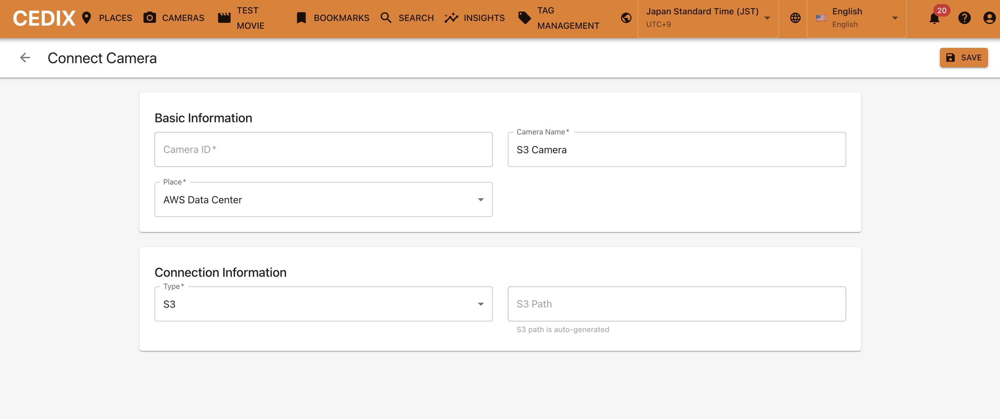
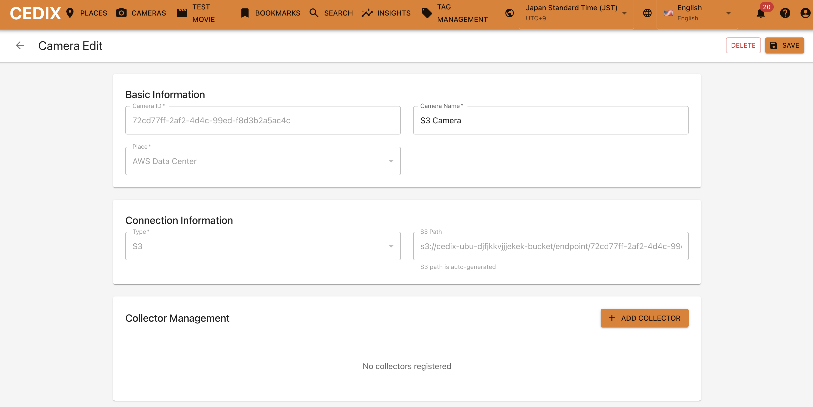
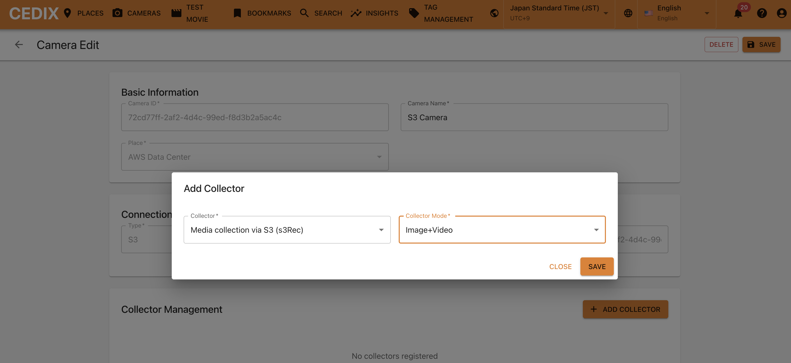
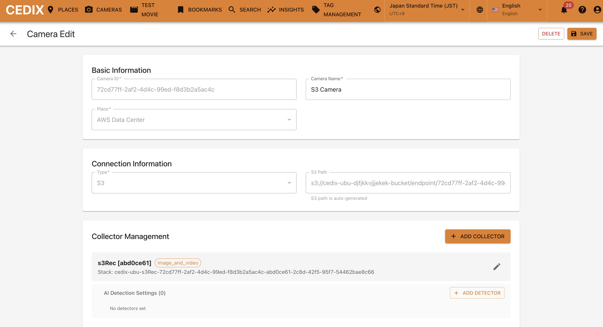
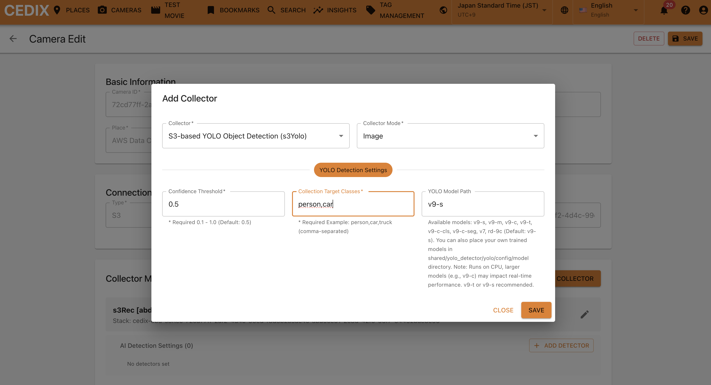
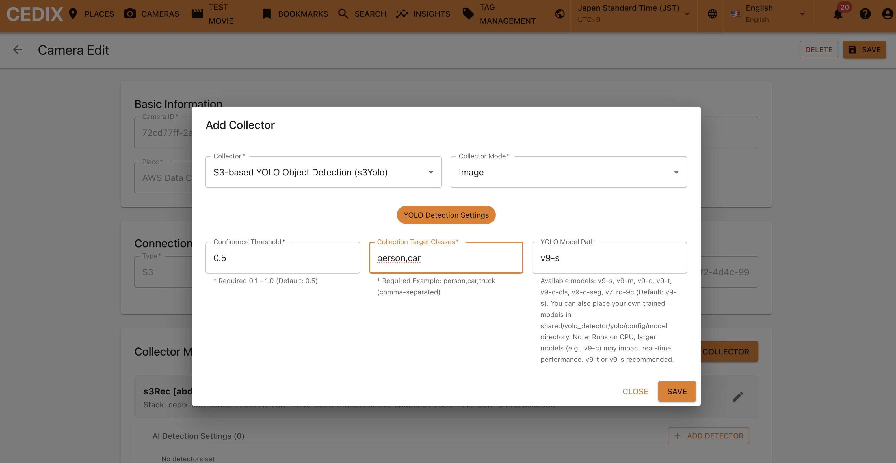
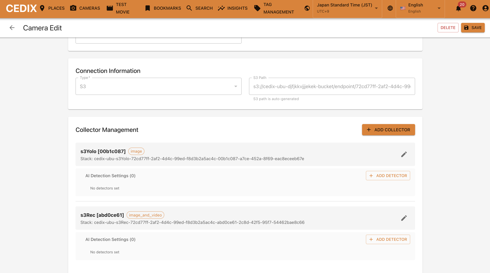
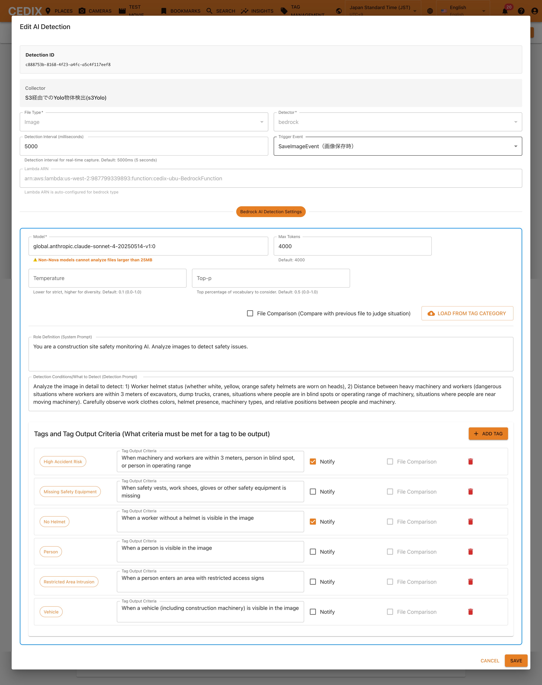

# Quick Start S3 for Camera
本ドキュメントではS3 用のカメラエンドポイントのセットアップに限定して記載します。基本的な説明は、RTSPカメラのQuickStetup資料にてご確認ください。本資料は、S3 の場合の差分のみを記載します。

[QuickSetup RTSPカメラ](doc/QUICK_START_RTSP.md)

### Camera 用のS3エンドポイントを作成する

完了すると S3 path という欄に、S3 のアップロード用エンドポイントが作成されます。

### 
### Collector を追加する (Recorder)
カメラを編集で開き、ADD COLLECTORをクリック。
※これはOptionですのでマストの作業ではありません。
s3Rec コレクターを選択し、モードは「画像+動画」としてSAVEをクリック

コレクターは CloudFormation でのデプロイのため一定時間かかります。状況を見たい場合は、コレクターをEditで開くと確認出来ます。

### Collector を追加する (Yolo Detection)
s3Yolo コレクターを選択し、モードは画像を選択ください（動画は選択できません）。その上で、検出設定を行います。HLSのケースと異なり、S3 の場合は、ファイルベースでの処理となるため、エリアの侵入/退出は検出できません。クラス検出のみ可能ですので、検出したいクラスを指定ください。
そして、YOLO Modelを選択します。現状は CPU環境での実行となっているのでv9-s のような小さいモデルを指定ください。ご自身で学習も可能で、学習したモデルは shared/yolo\_detector/yolo  以下に重みと一緒に配置ください。
※これはOptionですのでマストの作業ではありません。

コレクターは CloudFormation でのデプロイのため一定時間かかります。状況を見たい場合は、コレクターをEditで開くと確認出来ます。

### Detector を追加する
カメラを編集で開き、先程追加した s3Yolo コレクターにある「ADD DETECTOR」をクリック。
※これはOptionですのでマストの作業ではありません。
※ s3Yoloコレクターを使わず、s3RecコレクターにDETECTORを設定しても問題ありません。違いは s3Recの場合、全ての画像/動画に対してDETECTORを実行する一方で、hlsYoloの場合、クラス検出した時だけDETECTORを実行します。

ファイルタイプは「画像」、トリガーイベントは「Event」を選択ください (今回、hlsYoloにてエリアでの侵入/退出検出を選択したためAreaDetectEventとしていますが、実際はコレクターが出す何のイベント駆動で解析したいか？によって選んでください)。
その上で、このカメラの役割と検出させたいことをプロンプトで記載ください。
なお、検出結果をタグとして登録するには、事前にタグ管理画面にて検出したいタグを登録しておき、ADD TAGで呼び出す形で登録する必要があります。

