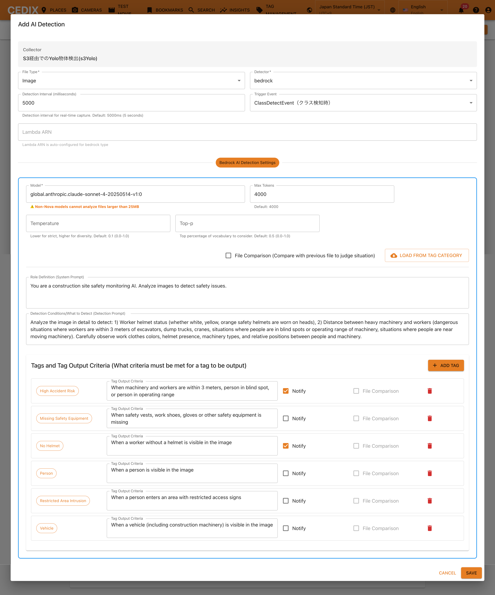
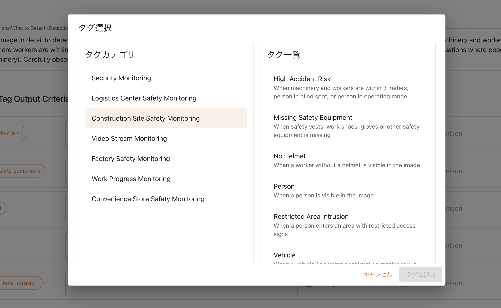
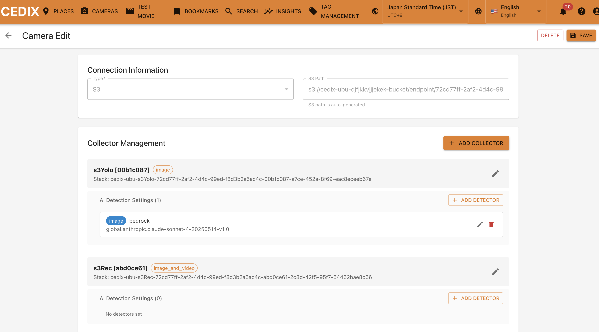
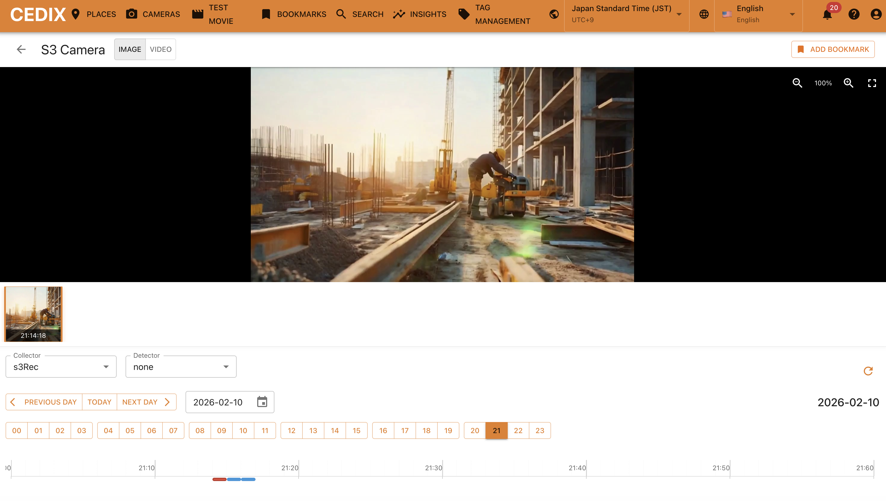
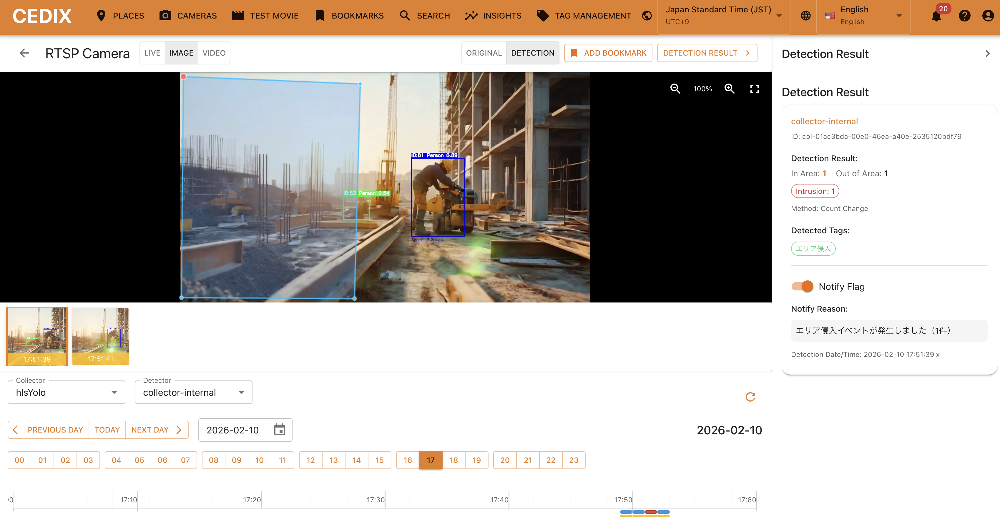
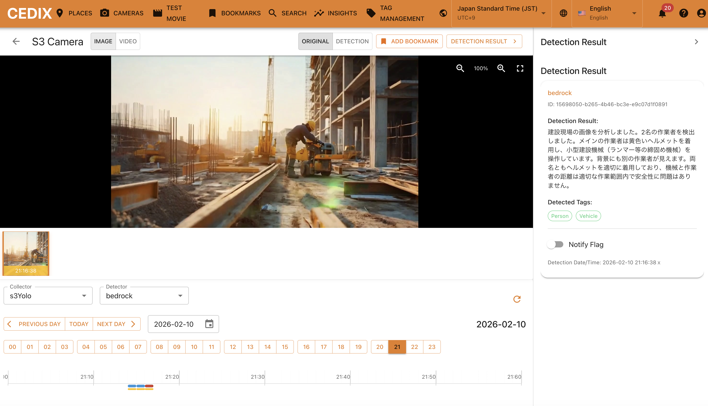

# Quick Start S3 for Camera

本ドキュメントではS3 用のカメラエンドポイントのセットアップに限定して記載します。基本的な説明は、RTSPカメラのQuickStetup資料にてご確認ください。本資料は、S3 の場合の差分のみを記載します。

[Quick Start RTSPカメラ](./QUICK_START_RTSP.md)

---

## Camera 用のS3エンドポイントを作成する

完了すると S3 path という欄に、S3 のアップロード用エンドポイントが作成されます。

---

## Collector を追加する (Recorder)

カメラを編集で開き、ADD COLLECTORをクリック。

> 📝 **注意**: これはOptionですのでマストの作業ではありません。

s3Rec コレクターを選択し、モードは「画像+動画」としてSAVEをクリック

コレクターは CloudFormation でのデプロイのため一定時間かかります。状況を見たい場合は、コレクターをEditで開くと確認出来ます。

---

## Collector を追加する (Yolo Detection)

s3Yolo コレクターを選択し、モードは画像を選択ください（動画は選択できません）。その上で、検出設定を行います。

> ⚠️ **注意**: HLSのケースと異なり、S3 の場合は、ファイルベースでの処理となるため、エリアの侵入/退出は検出できません。クラス検出のみ可能ですので、検出したいクラスを指定ください。

そして、YOLO Modelを選択します。現状は CPU環境での実行となっているのでv9-s のような小さいモデルを指定ください。

> 📝 **ヒント**: ご自身で学習も可能で、学習したモデルは `shared/yolo_detector/yolo` 以下に重みと一緒に配置ください。

> 📝 **注意**: これはOptionですのでマストの作業ではありません。

コレクターは CloudFormation でのデプロイのため一定時間かかります。状況を見たい場合は、コレクターをEditで開くと確認出来ます。

---

## Detector を追加する

カメラを編集で開き、先程追加した s3Yolo コレクターにある「ADD DETECTOR」をクリック。

> 📝 **注意**: これはOptionですのでマストの作業ではありません。

> 📝 **ヒント**: s3Yoloコレクターを使わず、s3RecコレクターにDETECTORを設定しても問題ありません。違いは s3Recの場合、全ての画像/動画に対してDETECTORを実行する一方で、hlsYoloの場合、クラス検出した時だけDETECTORを実行します。

ファイルタイプは「画像」、トリガーイベントは「ClassDetectEvent」を選択ください (今回、s3Yoloにてクラス検出を選択したためClassDetectEventとしていますが、s3Recの場合はSaveImageEvent/VideImageEventをご選択ください)。

その上で、このカメラの役割と検出させたいことをプロンプトで記載ください。

> 📝 **重要**: 検出結果をタグとして登録するには、事前にタグ管理画面にて検出したいタグを登録しておき、ADD TAGで呼び出す形で登録する必要があります。

登録すると、以下のように 「bedrock」 Detectorとして登録されます。

---

## テスト：S3 エンドポイントに画像や動画をアップロードする

アップロード方法はお任せします。AWS CLIからでも、AWS コンソールからでも自由な方法をご選択ください。

---

## Collector を確認する (Recorder)

カメラを選択して、IMAGEタブを選択します。さらに、Collectorのセレクトボックスで、s3Rec を選択。以下のように切り出された画像が時系列に表示されていれば成功です。

---

## Collectorを確認する (Yolo Detection)

カメラを選択して、IMAGEタブを選択します。さらに、Collectorのセレクトボックスで、s3Yolo を選択し、Detectorにて「collector-internal」を選択。左上で「DETECTION」タブを選択し、「DETECTION RESULT」ボタンを押して、右サイドパネルを開きます。すると↓のような画面となります。

指定したクラス検出のタイミングで画像が生成され、RESULTにてその検出結果の詳細を確認できます。

---

## Detectorを確認する

カメラを選択して、IMAGEタブを選択します。さらに、Collectorのセレクトボックスで、s3Yolo を選択し、Detectorにて「bedrock」を選択。

左上の「DETECTION RESULT」ボタンを押して、右サイドパネルを開きます。すると↓のような画面となります。

指示の内容に従って検出が実行されます。ヒットするタグがある場合、検出されたタグも確認できます。

> ⏱️ **注意**: s3YoloのDetectionは、Lambdaの起動に時間がかかる都合上、ColdStartの場合は反映まで2-3分かかります。HotStartの場合はすぐに反映されます。

